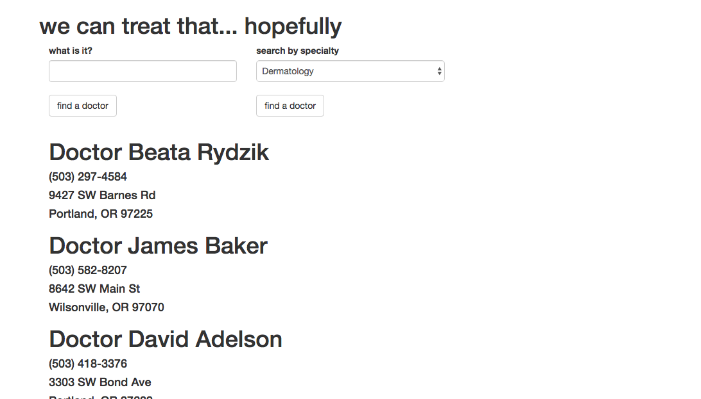

# Better Doctor API

This project will save your life and quite possibly the world! A simple web app for you to input your symptom that will return a list of doctors near you that could best help!

### Prerequisites

Web browser with ES6 compatibility
Examples: Chrome, Safari

* npm
* bower
* ruby

### Installing

These instructions have been verified to work on MacOS.

There are a few terminal commands you will need to run to get the app to launch locally on your machine. First though, you will need to clone this repository to your machine and navigate to its folder in your terminal.

Once you have navigated to the correct directory, you will run the following commands:

* bower install
* npm install

The required packages may take a few minutes to download and install due to the speed of your machine and your Internet connection. 

There is an environment variable you will need as well that is not included in the repository, the Better Doctor API key. You will need to sign up for an account here https://developer.betterdoctor.com/ to get your own key. In the root directory of this project you must create a file named '.env' with one line in it:

* exports.apiKey = "YOUR-KEY-GOES-HERE"

The single quotes should not be in the file but the double quotes should. Once this file is in place you can return to the terminal and run the following command.

* gulp serve

This last command should launch the app in your browser! That's it!

## Built With

* HTML
* CSS/SASS
* Bootstrap https://getbootstrap.com/
* ES6
* Jquery https://jquery.com/
* Node
* Bower

## Learned

This week was all about API requests and boy was it interesting! The most important thing I learned about APIs is that they are expensive. And I don't mean that they cost money, but that they cost time. Some requests are so big that they literally take ten or more seconds to return anything. So, instead of calling multiple times for small amounts of data, make one call for all the data you need and use your code to parse the response.

Another thing I learned was how dangerous unknown objects are. I will give you an example from one line of code I wrote:

* query.data.practices[0].visit_address.city

That is wildly too deep. What if practices isn't present? What if the practice doesn't have a visit_address? To improve my code I would focus more time and effort parsing the nested calls so that if any of them are not present, instead of getting an error, I would get an empty string or nill.

#### Searching by Condition

#### Searching by Specialty

## Authors

* Spencer Alan Ruiz

## License

MIT License

Copyright (c) 2017 Spencer Alan Ruiz

Permission is hereby granted, free of charge, to any person obtaining a copy
of this software and associated documentation files (the "Software"), to deal
in the Software without restriction, including without limitation the rights
to use, copy, modify, merge, publish, distribute, sublicense, and/or sell
copies of the Software, and to permit persons to whom the Software is
furnished to do so, subject to the following conditions:

The above copyright notice and this permission notice shall be included in all
copies or substantial portions of the Software.

THE SOFTWARE IS PROVIDED "AS IS", WITHOUT WARRANTY OF ANY KIND, EXPRESS OR
IMPLIED, INCLUDING BUT NOT LIMITED TO THE WARRANTIES OF MERCHANTABILITY,
FITNESS FOR A PARTICULAR PURPOSE AND NONINFRINGEMENT. IN NO EVENT SHALL THE
AUTHORS OR COPYRIGHT HOLDERS BE LIABLE FOR ANY CLAIM, DAMAGES OR OTHER
LIABILITY, WHETHER IN AN ACTION OF CONTRACT, TORT OR OTHERWISE, ARISING FROM,
OUT OF OR IN CONNECTION WITH THE SOFTWARE OR THE USE OR OTHER DEALINGS IN THE
SOFTWARE.
